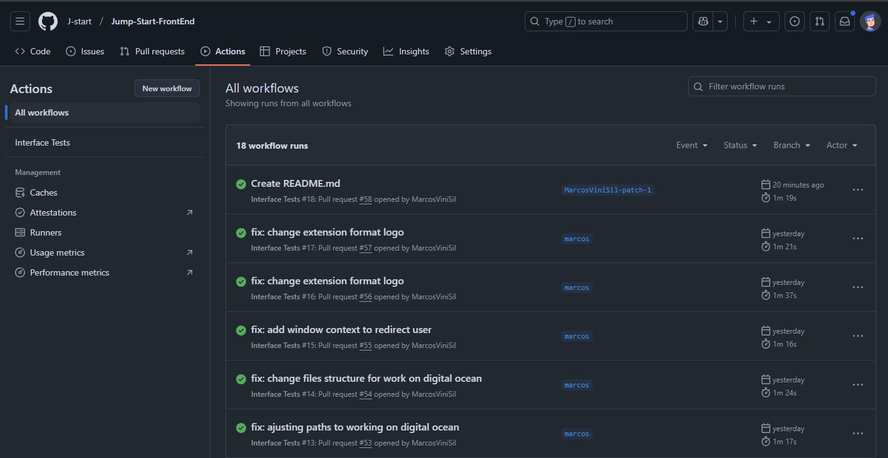
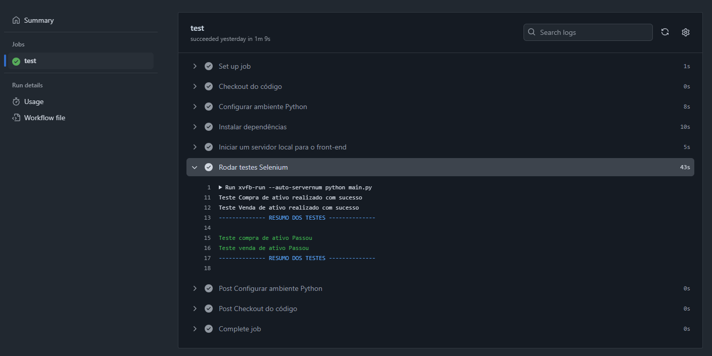

# Jump-start - Uma aplicação para entender sobre a compra, venda e mercado de ativos financeiros

  
https://github.com/user-attachments/assets/a50fb15c-97cb-4b94-b4ba-c4db8439f3f6

## Tecnologias e ferramentas utilizadas
- HTML
- CSS
- JavaScript
- Python (Testes selenium)
- Chart.js (Gráficos)
- Digital Ocean (Deploy)

## Api's utilizadas
  - [awesomeapi](http://economia.awesomeapi.com.br/)
  - [mercado bitcoin](https://api.mercadobitcoin.net/)
  - [yfinance (python)](https://github.com/ranaroussi/yfinance)

## Integração Contínua(CI) - Foi criado testes base de compra e venda de ativos utilizando selenium para verificação local e também foi adicionado o mesmo código ao github actions para integração contínua.

## Como executar a aplicação

- Clone o repositório com o comando `git clone https://github.com/J-start/Jump-Start-FrontEnd.git`

- Navegue até os arquivos clonados com `cd Jump-Start-FrontEnd`

- Se a api estiver disponível, basta acessar o arquivo index.html

- Se a api não estiver online, acesse o repositório abaixo e disponibilize-a localmente 

[link api-backend](https://github.com/J-start/Jump-Start-BackEnd)

Obs: No caso de executar a api local é necessário que a constante `URL`, que está no arquivo `urlBackEnd.js`, seja `http://localhost:8080` 

## Testes - Para executar os testes, siga os passos abaixo:
- Navegue até a raiz do projeto com `cd Jump-Start-FrontEnd`
- Certifique-se de ter o python instalado e a api estar funcionando, localmente ou remotamente
- Instale as dependências necessárias com `python -r requirements.txt`
- Execute: `python main.py`

